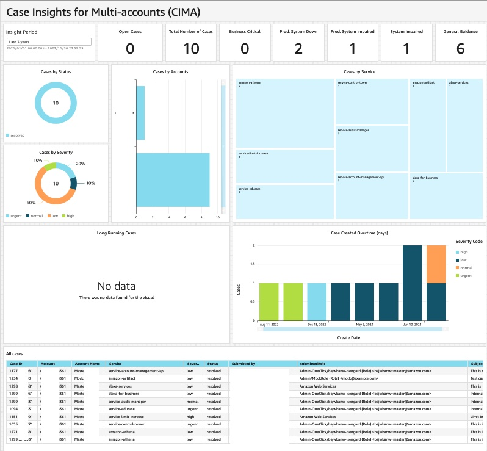
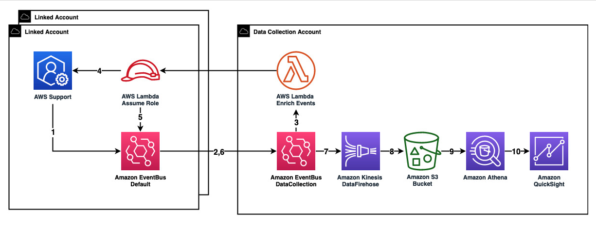

# What is this solution indented for?

AWS-CIMA (Case Insights for Multi-Accounts) presents a visualization dashboard that simplifies the task of overseeing and tracking cases across multiple accounts and multiple aws organization. This dashboard streamlines the process of monitoring cases, so customers can conveniently manage and track the status and progress of all cases without logging in to each individual AWS account.

**Key Features:**

* Centralized Visualization Dashboard: CIMA offers a centralized dashboard that aggregates case data from various accounts within an AWS Organization. This enables users to view and analyze case information from a single point of access. 

* Streamlined Case Monitoring: CIMA provides a streamlined interface where users can track the status, progress, and key metrics of all cases across multiple accounts. This removes the need for manual tracking and logging into each account separately.

* Real-time Updates: CIMA utilizes an event-driven architecture to capture any support case updates, so that users can have timely access to case status and progress across accounts. This information empowers organizations to make informed decisions and take actions, which improves business process efficiency. 

 
 
# Solution Architecture
The following diagram illustrates a multi-account structure. The DataCollection Account refers to the account which will display the unified Amazon QuickSight dashboard, and will receive events routed from the current account as well as all other accounts within your AWS Organizations. The Linked Accounts refer to any accounts other than the DataCollection Account, routing enriched events to the DataCollection Account. 
 

The DataCollection architecture consists of an AWS EventBridge custom bus, an AWS EventBridge rule, an AWS Lambda function and Amazon S3 bucket. The presentation layer includes an Amazon Quicksight dashboard and Amazon Athena as the query engine. The Linked Account architecture consists of a role which Lambda Function in DataCollection Account assumes, EventBridge rules, and AWS Support.

1. AWS Support emits events and places them in the default event bus associated with the account whenever a case is opened, updated, or closed.

2. In a linked account, events matching the pattern ({"source": ["aws.support"]}) are forwarded to the DataCollection Account.

3. The AWS EventBridge custom bus receives events from linked accounts. When an event matches the pattern ({"source": ["aws.support"]}), an AWS EventBridge rule is triggered, activating an AWS Lambda function. This Lambda function assumes a role in the account from which the event originated.

4. The Lambda function invokes the AWS Support API in the linked account, enhancing the event by appending a user-friendly message.

5. Subsequently, the Lambda function places the enriched event on the default bus, labeling the source as ({"source": ["heidi.support"]}).

6. In the linked account, an AWS EventBridge rule on the default bus publishes an event to the custom bus in the DataCollection Account when it matches the pattern ({"source": ["heidi.support"]}).

7. Upon receiving the event in the AWS DataCollection Account with the source label ({"source": ["heidi.support"]}), another EventBridge rule is triggered. This rule sends the event to Amazon Kinesis Data Firehose, which then places the event in an S3 bucket.

# Prerequisite
To setup this solution, you need to have an AWS account and be familar with the AWS Management Console:
1.	To use the AWS Support API in the provided AWS CloudFormation template, you need to have AWS Business Support, AWS Enterprise On-Ramp or AWS Enterprise Support plan. 
2.	You will need to sign up for Amazon QuickSight Enterprise Edition to use the forecast capability in the provided template. 
3.	Your Amazon QuickSight service should have access to Amazon Athena. To enable this access, go to security and permissions under manage QuickSight drop down menu. 
4.	The provided template uses Amazon QuickSight SPICE to hold data. Ensure you have sufficient SPICE capacity to hold your support case data. You can view the available SPICE capacity under manage QuickSight drop down menu.
5.	[Install](https://docs.aws.amazon.com/serverless-application-model/latest/developerguide/install-sam-cli.html) AWS SAM CLI

# Deploying the solution
In this section, we will go through the steps to set up components for both the central and Linked Accounts.

**DataCollection Account Setup**
This repository provides a sample code that demonstrates how to set up all the essential components to receive case data from Linked Accounts. 
1.	Login to your AWS account and launch AWS CloudShell.
2.	Clone the CIMA repository from GitHub using the command:

```bash
git clone https://github.com/aws-samples/case-Insights-for-multi-accounts.git
```

3.	Navigate to the case-insights-for-multi-accounts directory, and run the setup script.

```bash
cd case-insights-for-multi-accounts/src
python3 OneClickSetup.py
```

4. Select CentralAccount and follow the on-screen instructions.

**Linked Account Setup**
Once the DataCollection setup is complete, you can proceed with the Linked Account setup. There are two options for deployment in the Linked Account: 

**Option 1:** Using setup script.
1.	Launch AWS CloudShell in us-east-1 and clone the CIMA repository from GitHub using the command:

```bash
git clone https://github.com/aws-samples/case-insights-for-multi-accounts.git
```

2.	Navigate to the case-insights-for-multi-accounts directory, and run the setup script.

```bash
cd case-insights-for-multi-accounts/src
python3 OneClickSetup.py
```

3. Select MemberAccount and follow the on-screen instructions.

**Option 2:** Bulk deployment via StackSet:
1.	Navigate to the AWS CloudFormation console. 
2.	Download the [Linked Account template](https://github.com/aws-samples/case-insights-for-multi-accounts/blob/main/README.md).
3.	Create an AWS CloudFormation StackSet with the downloaded template.
4.	Provide the *CimaBusArn*, copied from step 6 of the DataCollection Account setup.
5.	Select deployment targets. You have the option to deploy to AWS Organization Unit (OU) or deploy to your entire AWS Organization.
6.	Select us-east-1 as the region for deployment.
7.	Submit.


[](https://github.com/aws-samples/case-insights-for-multi-accounts)
