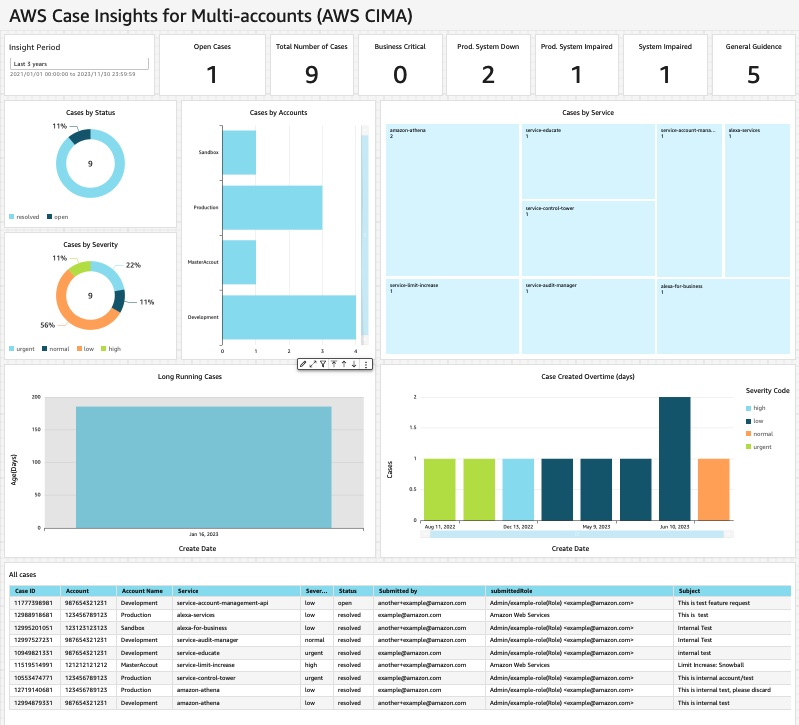

# What is this solution indented for?

AWS-CIMA (Case Insights for Multi-Accounts) presents a visualization dashboard that simplifies the task of overseeing and tracking cases across multiple accounts within an organization. This dashboard streamlines the process of monitoring cases, so customers can conveniently manage and track the status and progress of all cases without logging in to each individual AWS account.

**Key Features:**

* Centralized Visualization Dashboard: CIMA offers a centralized dashboard that aggregates case data from various accounts within an AWS Organization. This enables users to view and analyze case information from a single point of access. 

* Streamlined Case Monitoring: CIMA provides a streamlined interface where users can track the status, progress, and key metrics of all cases across multiple accounts. This removes the need for manual tracking and logging into each account separately.

* Real-time Updates: CIMA utilizes an event-driven architecture to capture any support case updates, so that users can have timely access to case status and progress across accounts. This information empowers organizations to make informed decisions and take actions, which improves business process efficiency. 

<div align="center">
  
</div>

# Solution Architecture
The following diagram illustrates a multi-account structure. The central account refers to the account which will display the unified Amazon QuickSight dashboard, and will receive events routed from the current account as well as all other accounts within your AWS Organizations. The link accounts refer to any accounts other than the central account, routing enriched events to the central account. 
 

**Central Account Overview** The central account architecture consists of an AWS EventBridge custom bus, an AWS EventBridge rule, an AWS Lambda function and an Amazon DynamoDB table. The presentation layer includes an Amazon Quicksight dashboard and Amazon Athena as the query engine. 
1.	The AWS EventBridge custom bus receives events from the link accounts. When an event match the pattern `({"source": ["aws.Cima"]})`, an AWS EventBridge rule triggers an AW Lambda function, which places the event in the Amazon DynamoDB table.
2.	Amazon QuickSight connects to the Amazon DynamoDB table though the Amazon Athena federated query and presents the data in a single dashboard. 

**Link Account Overview** The link account architecture consists of an AWS Lambda function, two AWS EventBridge rules, and AWS Support.
1.	When a case is opened, updated, or closed, AWS Support emits an event and puts the event in the default event bus associated with the account. 
2.	The first AWS EventBridge rule on the default bus triggers an AWS Lambda function when the event matches the pattern `({"source": ["aws.support"]})` and passes the case-id to the AWS Lambda function.
3.	The AWS Lambda function invokes the AWS Support API, enhances the event by appending a user-friendly message, and subsequently puts the enriched event on the default bus with the source labeled as "Cima".
4.	The second AWS EventBridge rule on the default bus publishes an event to the AWS EventBridge custom bus in the central account when it matches the pattren `({"source": ["aws.Cima"]})`

# Prerequisite
To setup this solution, you need to have an AWS account and be familar with the AWS Management Console:
1.	To use the AWS Support API in the provided AWS CloudFormation template, you need to have AWS Business Support, AWS Enterprise On-Ramp or AWS Enterprise Support plan. 
2.	You will need to sign up for Amazon QuickSight Enterprise Edition to use the forecast capability in the provided template. 
3.	Your Amazon QuickSight service should have access to Amazon Athena. To enable this access, go to security and permissions under manage QuickSight drop down menu. 
4.	The provided template uses Amazon QuickSight SPICE to hold data. Ensure you have sufficient SPICE capacity to hold your support case data. You can view the available SPICE capacity under manage QuickSight drop down menu.

# Deploying the solution
In this section, we will go through the steps to set up components for both the central and link accounts.

**Central Account Setup**
This repository provides a sample code that demonstrates how to set up all the essential components to receive case data from link accounts. 
1.	Login to your AWS account and launch AWS CloudShell.
2.	Clone the CIMA repository from GitHub using the command:

```bash
git clone https://github.com/aws-samples/Case-Insights-for-Multi-accounts.git
```

3.	Navigate to the case-insights-for-multi-accounts directory, and run the setup script.

```bash
cd case-insights-for-multi-accounts
python3 CentralAccountSetup.py
```

You will be prompted to enter your AWS account ID, the Amazon S3 bucket name for storing AWS CloudFormation template files, the IAM role used by Amazon QuickSight, and the Amazon QuickSight user who will author the Amazon QuickSight dashboard. 

4.	Monitor the AWS CloudFormation deployment progress by navigating to the AWS CloudFormation console. Look for the stack named *CimaDashboardStack-YourAccountID*.
5.	If you see a “CREATE_COMPLETE” message for your CloudFormation stack, navigate to the Amazon QuickSight service under the supplied username in step 3. You should see a populated Amazon QuickSight dashboard similar to the one below.
6.	Navigate to the nested stack named *CimaDashboardStack-YourAccountID-CimaCentralAccSetup-9DigitsHash*. Copy and save the output value for *CimaBusArn*. You will need this value in link account setup.

**Link Account Setup**
Once the central account setup is complete, you can proceed with the link account setup. There are two options for deployment in the link account: 

**Option 1:** Using setup script.
1.	Launch AWS CloudShell in us-east-1 and clone the CIMA repository from GitHub using the command:

```bash
git clone https://github.com/aws-samples/case-insights-for-multi-accounts.git
```

2.	Navigate to the case-insights-for-multi-accounts directory, and run the setup script.

```bash
cd case-insights-for-multi-accounts`
python3 LinkAccountSetup.py
```

You will be prompted to enter your CimaBusArn, copied from step 6 of the central account setup. 

**Option 2:** Bulk deployment via StackSet:
1.	Navigate to the AWS CloudFormation console. 
2.	Download the [link account template](https://github.com/aws-samples/case-insights-for-multi-accounts/blob/main/README.md).
3.	Create an AWS CloudFormation StackSet with the downloaded template.
4.	Provide the *CimaBusArn*, copied from step 6 of the central account setup.
5.	Select deployment targets. You have the option to deploy to AWS Organization Unit (OU) or deploy to your entire AWS Organization.
6.	Select us-east-1 as the region for deployment.
7.	Submit.
