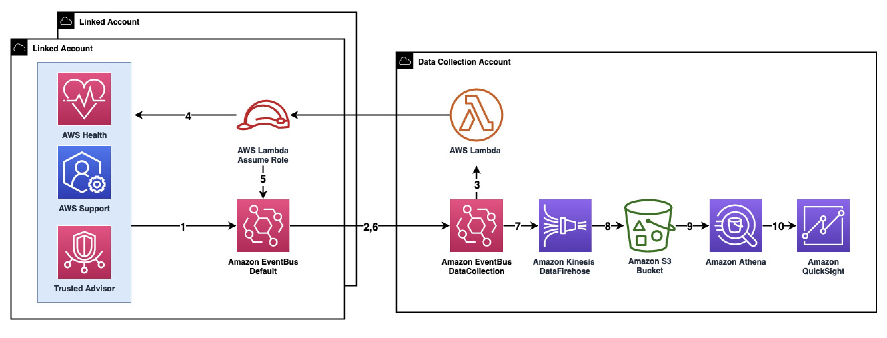

# Consolidated Insights from Multiple Accounts(CIMA)

CIMA (Consolidated Insights from Multiple Accounts) presents an efficient mechanism for data collection, visualization, and notifications. Operating on an event-driven model, CIMA simplifies the collection of data from various AWS services across numerous accounts within multiple AWS organizations. CIMA generates QuickSight dashboard that is designed to streamline the monitoring of AWS events in a user-friendly format, enabling customers to conveniently access a comprehensive overview without the need to log in to each individual AWS account. 

CIMA consists of following Modules.

* Support Case Module (Unified view of all cases across all the AWS Accounts and AWS organizations)
* Health Module (Unified view of Upcoming events, Planned events(EOL) scheduled events and issues across all AWS Accounts and AWS Organizations)
* Trusted Advisor Module (Unified view of all TA checks across all the AWS Accounts and AWS Organizations)
* Notification Module (Powered by AWSChat bot to get Notification on Slack or Teams)
* TBC
 
# Solution Architecture

The following diagram illustrates a multi-account structure. The DataCollection Account refers to the account which will display the unified Amazon QuickSight dashboard, and will receive events routed from the current account as well as all other accounts within your AWS Organizations. The link accounts refer to any accounts other than the DataCollection Account, routing enriched events to the DataCollection Account. The DataCollection architecture consists of an AWS EventBridge custom bus, an AWS EventBridge rule, an AWS Lambda function and Amazon S3 bucket. The presentation layer includes an Amazon Quicksight dashboard and Amazon Athena as the query engine. The link account architecture consists of a role which Lambda Function in DataCollection Account Assumes, and One AWS EventBridge rules, and AWS Support.

 


# Prerequisite
To setup this solution, you need to have an AWS account and be familar with the AWS Management Console:
1.	To use the AWS Support API in the provided AWS CloudFormation template, you need to have AWS Business Support, AWS Enterprise On-Ramp or AWS Enterprise Support plan. 
2.	You will need to sign up for Amazon QuickSight Enterprise Edition to use the forecast capability in the provided template. 
3.	Your Amazon QuickSight service should have access to Amazon Athena. To enable this access, go to security and permissions under manage QuickSight drop down menu. 
4.	The provided template uses Amazon QuickSight SPICE to hold data. Ensure you have sufficient SPICE capacity to hold your support case data. You can view the available SPICE capacity under manage QuickSight drop down menu.

# Deploying the solution
In this section, we will go through the steps to set up components for both the central and link accounts.

**DataCollection Account Setup**
This repository provides a sample code that demonstrates how to set up all the essential components to receive case data from link accounts. 
1.	Login to your AWS account and launch AWS CloudShell.
2.	Clone the CIMA repository from GitHub using the command:

```bash
git clone https://github.com/aws-samples/case-Insights-for-multi-accounts.git
```

3.	Navigate to the case-insights-for-multi-accounts directory, and run the setup script.

```bash
cd case-insights-for-multi-accounts/src/utils
python3 OneClickSetup.py
```

4. Select CentralAccount and follow the instruction for required module

**Link Account Setup**
Once the DataCollection setup is complete, you can proceed with the link account setup. There are two options for deployment in the link account: 

**Option 1:** Using setup script.
1.	Launch AWS CloudShell in us-east-1 and clone the CIMA repository from GitHub using the command:

```bash
git clone https://github.com/aws-samples/case-insights-for-multi-accounts.git
```

2.	Navigate to the case-insights-for-multi-accounts directory, and run the setup script.

```bash
cd case-insights-for-multi-accounts/src/Setup
python3 OneClickSetup.py
```

3. Select MemberSetup and follow the instruction for required module

**Option 2:** Bulk deployment via StackSet:
1.	Navigate to the AWS CloudFormation console. 
2.	Download the [link account template](https://github.com/aws-samples/case-insights-for-multi-accounts/blob/main/README.md).
3.	Create an AWS CloudFormation StackSet with the downloaded template.
4.	Provide the inputs.
5.	Select deployment targets. You have the option to deploy to AWS Organization Unit (OU) or deploy to your entire AWS Organization.
6.	Select us-east-1 as the region for deployment.
7.	Submit.


[](https://github.com/aws-samples/case-insights-for-multi-accounts)
